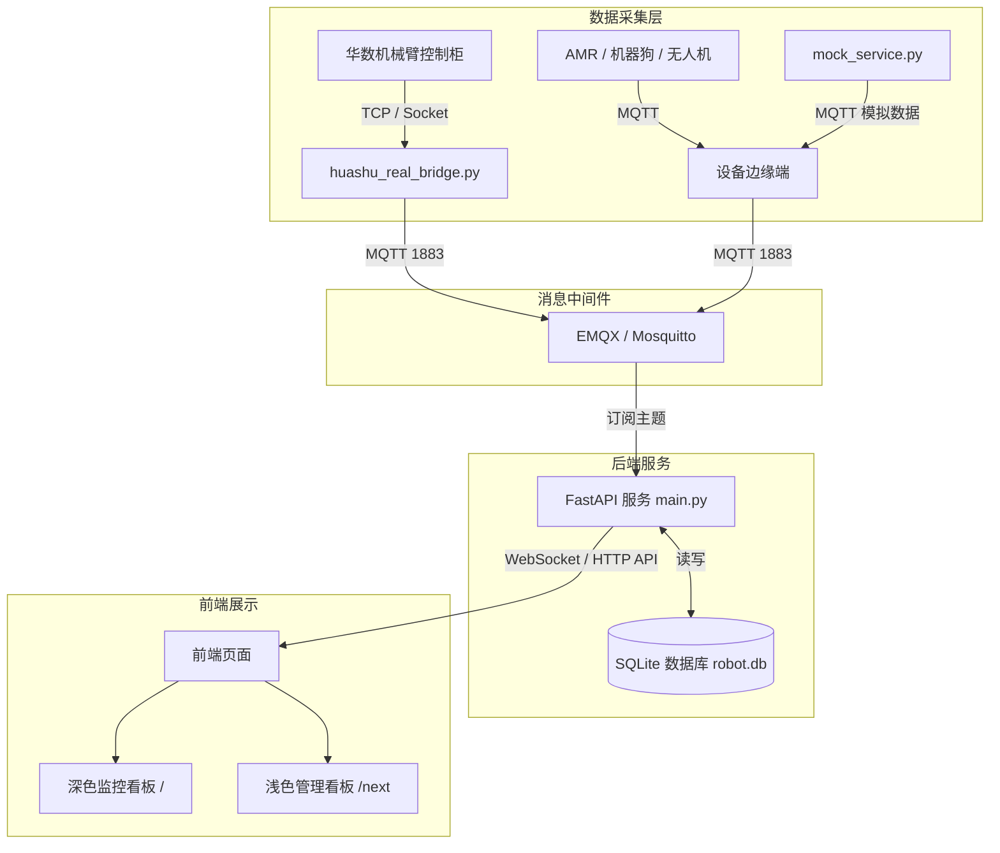

# 机器人物联网智能管控平台 (Robot IoT Fleet Management System)

本项目是一套用于工业机器人设备集群监控、工况遥测分析与三维状态展示的管理系统。
系统支持华数六轴工业机械臂、复合移动机器人 (AMR)、四足仿生巡检机器狗以及巡查无人机等多种工业智能装备的统一接入、状态监测、三维姿态展示与故障统计。

---

## 主要功能

1. **多设备接入与状态监控**
   - 支持通过 MQTT 协议接入不同品类的机器人设备；
   - 实时采集各设备的运行状态（在线/离线/报警）、工作电流、伺服温度、电池电量、空间坐标与关节角度。

2. **三维数字孪生与姿态展示**
   - 基于 Three.js 实现三维场景渲染；
   - 机械臂模型根据实时关节角度联动展示，移动机器人根据定位坐标实时更新位置。

3. **运行日志与报表分析**
   - 记录设备运行日志与通信报文流水；
   - 提供每日/每月运行报表，统计设备稼动率、作业节拍、累计运行时长等指标。

4. **故障记录与报警统计**
   - 实时记录设备报警信息与历史故障；
   - 提供报警频次统计、近期趋势图表及常见故障分类参考。

5. **双主题界面支持**
   - 提供深色监控大屏界面（访问地址：`/`）；
   - 提供浅色管理后台界面（访问地址：`/next`）。

---

## 支持设备

| 设备类型 | 接入协议 | 监控主要数据 |
| :--- | :--- | :--- |
| **六轴工业机械臂** | HSC3 通信 / MQTT | 六轴关节角度、末端坐标 (X, Y, Z, A, B, C)、伺服电机温度、负载电流、使能与急停状态 |
| **复合移动机器人 (AMR)** | MQTT / ROS | 平面坐标 (X, Y, Yaw)、避障传感器距离、轮速、顶升状态、电池电量 |
| **四足巡检机器狗** | MQTT | 关节电机状态、姿态角 (Roll, Pitch, Yaw)、步态模式、电池电量 |
| **巡查无人机** | MAVLink / MQTT | GPS 经纬度与搜星数、飞行高度、电机转速、电池电量 |

---

## 技术架构

### 核心技术栈

- **后端服务**：Python 3.10+ / FastAPI / Uvicorn
- **消息总线**：MQTT (EMQX 5.x / Mosquitto)
- **数据存储**：SQLite 3（WAL 模式）
- **前端技术**：原生 JavaScript / Three.js (WebGL) / Tailwind CSS / ECharts / Chart.js

### 架构拓扑



---

## 项目目录结构

```text
.
├── database.py              # 数据库操作层（表结构、数据读写、报表与统计计算）
├── deploy_new_server.sh     # Linux 服务器自动化部署脚本
├── huashu_real_bridge.py    # 华数机械臂现场采集推流脚本
├── launcher.py              # 应用统一启动引导入口
├── main.py                  # FastAPI 主服务（API 路由、WebSocket 通信、MQTT 监听）
├── mock_robot.py            # 多设备遥测仿真计算模块
├── mock_service.py          # 模拟遥测数据生成服务
├── requirements.txt         # Python 依赖清单
├── robot-iot.service        # Linux systemd 服务配置文件
├── robot-mock.service       # 模拟服务 systemd 配置文件
├── start.sh / stop.sh       # 服务启动与停止脚本
├── update_server.sh         # 系统更新维护脚本
├── huashu_bridge/           # 机械臂通信适配模块
│   ├── huashu_adapter.py    # 通信适配逻辑
│   ├── huashu_config.json   # 采集参数配置
│   ├── start_huashu_bridge.bat # Windows 启动脚本
│   └── start_huashu_bridge.sh  # Linux 启动脚本
├── huashu_edge_agent/       # 边缘端轻量采集模块
│   ├── edge_config.json     # 边缘配置
│   ├── huashu_edge_collector.py # 边缘采集脚本
│   └── requirements.txt     # 边缘采集依赖
└── static/                  # 前端静态资源
    ├── index.html           # 监控大屏主页面（深色主题）
    ├── index_next.html      # 管理后台页面（浅色主题）
    ├── js/                  # 前端脚本与渲染库 (Three.js 等)
    ├── css/                 # 样式文件
    ├── models/br610/        # 机械臂 3D 模型文件
    └── assets/              # 图标与图片素材
```

---

## 快速开始

### 1. 本地运行 (Windows / macOS / Linux)

#### 步骤一：安装依赖
```bash
pip install -r requirements.txt
```

#### 步骤二：启动后台主服务
```bash
python main.py
```
服务默认监听本地 `8000` 端口。

#### 步骤三：启动数据推流（任选一种）
- **模式 A（本地测试）**：启动模拟器生成设备运行数据
  ```bash
  python mock_service.py
  ```
- **模式 B（现场接入）**：启动华数机械臂采集推流脚本（需在同一局域网并配置实际 IP）
  ```bash
  python huashu_real_bridge.py
  ```

#### 步骤四：浏览器访问
- 深色监控看板：`http://localhost:8000`
- 浅色管理后台：`http://localhost:8000/next`

---

### 2. 服务器部署 (Ubuntu 20.04 / 22.04 LTS)

#### 自动安装与配置
```bash
chmod +x deploy_new_server.sh
sudo ./deploy_new_server.sh
```

#### 启停管理
```bash
# 启动服务
sudo ./start.sh

# 停止服务
sudo ./stop.sh

# 查看运行状态
sudo systemctl status robot-iot.service
```

---

## 通信协议与 API 概览

### 1. MQTT 数据主题

- 机械臂状态上报：`robot/huashu_arm/{device_id}/state`
- AMR 状态上报：`robot/amr/{device_id}/state`
- 机器狗状态上报：`robot/dog/{device_id}/state`
- 无人机状态上报：`robot/uav/{device_id}/state`
- 控制指令下发：`robot/control/{device_id}/command`

### 2. 主要 HTTP 接口

| 请求方式 | 接口地址 | 说明 |
| :--- | :--- | :--- |
| `GET` | `/api/devices` | 获取所有设备最新状态列表 |
| `GET` | `/api/devices/{type}/{id}` | 获取指定设备的详细信息与工况参数 |
| `GET` | `/api/devices/{type}/{id}/logs` | 获取指定设备的运行与操作日志 |
| `GET` | `/api/devices/{type}/{id}/report` | 获取设备稼动率与运行状态统计报告 |
| `GET` | `/api/devices/{type}/{id}/alarms/analytics` | 获取设备历史报警统计与分类数据 |
| `POST`| `/api/devices/{type}/{id}/control` | 向指定设备下发控制指令（启动、停止、复位等） |
| `GET` | `/api/devices/{type}/{id}/backup` | 下载设备配置与历史数据备份包 (.zip) |
| `WS`  | `/ws/telemetry` | WebSocket 实时遥测数据流通道 |
