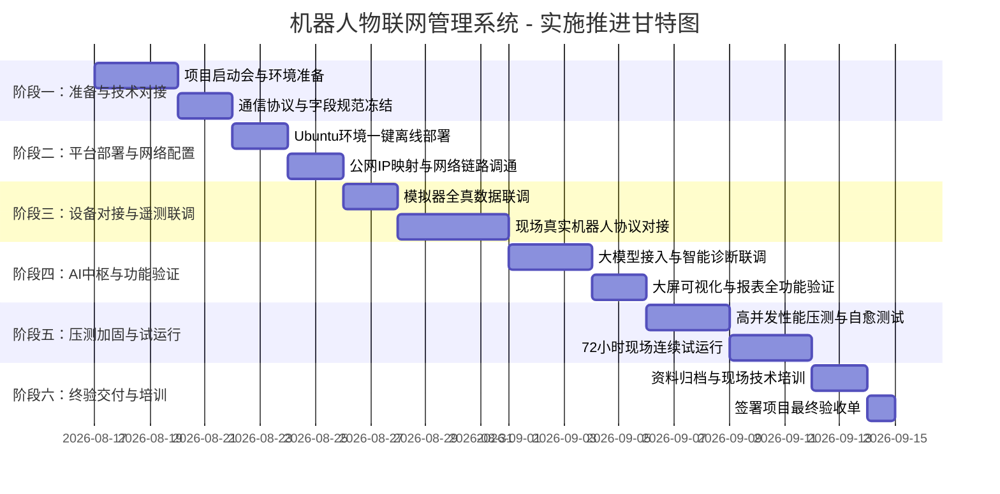

# 📋 机器人物联网管理系统 — 项目实施与工作任务推进计划书

> **项目名称**：机器人物联网管理系统 (Robot IoT Fleet Management Cloud Platform)  
> **合同编号**：IOT-20260811  
> **文档版本**：v1.0 (正式生效版)  
> **编制日期**：2026年08月17日  
> **适用对象**：甲方项目管理团队、乙方项目实施组、现场电气与网络运维团队

---

## 📌 一、项目概述与总体目标

本项目旨在为智能制造与多品类机器人巡检场景打造一套**高可靠、低延迟、云边协同**的工业物联网管理平台。通过标准 MQTT 协议、FastAPI 高性能微服务、SQLite WAL 高并发存储与原生数据可视化大屏，实现对**华数BR610机械臂、珞石SR3+ AGV复合移动机器人、南沙四足机器狗及商业环境监测传感器**的实时遥测、故障预警、OEE 统计与 AI 智能运维诊断。

---

## 🚩 二、六大实施阶段与里程碑规划

| 阶段编号 | 阶段名称 | 关键目标 | 责任主导 | 交付物/里程碑标志 |
|:---|:---|:---|:---:|:---|
| **Phase 1** | **准备与技术对接期** | 双方技术拉通、明确网络与硬件条件、冻结 MQTT 报文规范 | 双方协同 | 《技术对接规范确认书》 |
| **Phase 2** | **平台部署与环境联调期** | 在 Ubuntu 22.04 服务器上完成 EMQX Broker 与 Web 平台离线一键部署，开通公网/局域网访问 | 乙方实施 | 平台服务正常运行（端口 8000/1883 就绪） |
| **Phase 3** | **设备接入与遥测联调期** | 华数机械臂、珞石AMR、四足狗按规范接入 1883 端口并实现遥测实时跳动与入库 | 双方协同 | 3 类机器人真实数据上报成功，入库率 100% |
| **Phase 4** | **AI 中枢与大屏功能验证期** | 验证 Web 实时大屏、历史数据分页检索、预测性维保与云端/本地大模型深度推理 | 乙方实施 | 大屏及 AI 专家诊断功能完整可用 |
| **Phase 5** | **压力测试与连续试运行期** | 模拟高频报文压力测试，断网自动重连容灾测试，开展 72 小时无故障试运行 | 乙方实施 | 《系统压测与自愈测试报告》 |
| **Phase 6** | **终期验收与技术培训交付** | 现场操作与运维培训，交付全套部署包、源码与技术文档，签署验收单 | 双方确认 | 签署《项目终期验收合格报告》 |

---

## 🔨 三、详细工作任务分解表 (WBS)

### 【阶段一】需求拉通与准备工作 (Day 1 ~ Day 3)
- [ ] **Task 1.1 项目启动与对接人拉通**
  - 确定甲乙双方技术接口人（平台软件负责人、现场机器人电气工程师、网络管理员）。
  - 明确现场 Ubuntu 服务器硬件配置（CPU ≥ 4核, 内存 ≥ 8GB, 存储 ≥ 100GB）。
- [ ] **Task 1.2 网络与安全准入确认**
  - 确认服务器静态内网 IP 分配及路由器防火墙规则（TCP 8000、1883、18083 端口开放）。
  - 确认公网 IP 直连或端口映射方案（如有外部远程查看需求）。
- [ ] **Task 1.3 通信协议规范交付与冻结**
  - 交付《设备对接技术文档.md》，冻结各品类机器人 MQTT Topic 命名及 JSON 格式规范。

---

### 【阶段二】平台软件部署与网络配置 (Day 4 ~ Day 6)
- [ ] **Task 2.1 离线软件包传输与校验**
  - 将 `robot-iot-standalone-ubuntu22.04.tar.gz` 部署包拷贝至服务器。
  - 进行 SHA-256 完整性校验，确认无文件损坏。
- [ ] **Task 2.2 离线一键自动化安装**
  - 执行 `sudo bash install.sh`，全自动完成：
    - Python 3.10 运行时与 38 个离线 Wheel 依赖安装
    - EMQX 5.8.0 工业级 MQTT Broker 安装与服务自启
    - systemd 系统守护服务 `robot-iot.service` 注册与开机启动
    - UFW 防火墙端口放行与环境健康自检
- [ ] **Task 2.3 网络访问与后台健康验证**
  - 验证局域网内任意终端可访问 `http://服务器IP:8000/`。
  - 验证 EMQX 控制台 `http://服务器IP:18083/` 登录与监听状态。

---

### 【阶段三】机器人设备接入与数据联调 (Day 7 ~ Day 12)
- [ ] **Task 3.1 模拟器全量数据闭环验证**
  - 启动系统自带的 3 机器人全真遥测模拟器（`./start.sh mock`）。
  - 验证华数臂（6 轴角度、电流）、珞石AMR（导航位姿、激光雷达）、四足狗（步态、IMU）每秒上报。
  - 验证大屏实时渲染、在线状态自适应点亮及报文 100% 入库。
- [ ] **Task 3.2 华数 BR610 机械臂现场接入联调**
  - 华数控制器配置 MQTT 客户端，连接至 `tcp://服务器IP:1883`。
  - 按照 `robot/huashu_arm/{device_id}/telemetry` 发布 6 轴位姿、关节温度、故障码。
- [ ] **Task 3.3 珞石 SR3+ 定制 AGV 复合机器人现场接入联调**
  - 珞石车载工控机通过 WiFi 连接至 MQTT Broker。
  - 按照 `robot/luxshare_amr/{device_id}/telemetry` 发布电池电量、坐标 (X,Y,Theta)、导航状态。
- [ ] **Task 3.4 南沙四足机器狗现场接入联调**
  - 机器狗车载计算单元通过 4G/WiFi 上报实时步态、里程计与姿态数据。
- [ ] **Task 3.5 边缘离线状态自愈判定**
  - 现场切断单台机器人电源，验证平台在 30 秒内准确将其状态置为 `🔴 offline`。
  - 重新通电后，验证平台在收到第 1 包报文时立即自动恢复 `🟢 online`。

---

### 【阶段四】大模型 AI 中枢与高级功能验证 (Day 13 ~ Day 16)
- [ ] **Task 4.1 大模型 API 接入配置与快捷联调**
  - 配置云端大模型（DeepSeek / 硅基流动 / 阿里云百炼 / 智谱 GLM）或本地私有模型（Ollama）。
  - 支持通过粘贴厂商提供的 `curl` 指令一键自动提取 API Key、Base URL 与 Model ID。
  - 点击「🧪 测试连通性」验证接口握手延时（正常区间 200~800ms）。
- [ ] **Task 4.2 AI 智能运维与专家诊断功能验证**
  - 验证多轮自然语言交互诊断：全域设备健康度评估、电机温度过温分析、工序排产策略。
  - 验证润滑油维保倒计时分析及自动生成维保工单建议。
  - 验证网络异常或未配置 API Key 时，系统无缝自动降级至本地边缘规则引擎。
- [ ] **Task 4.3 历史数据查询与导出验证**
  - 验证多条件（设备分类、状态、时间范围）历史遥测检索。
  - 验证分页查询性能（10 万条历史记录下翻页响应 < 50ms）。

---

### 【阶段五】系统稳定性压测与 72h 试运行 (Day 17 ~ Day 20)
- [ ] **Task 5.1 高频吞吐与并发入库压测**
  - 模拟 100 台虚拟设备同时以 100ms 频率推送报文（1,000 QPS）。
  - 验证 SQLite WAL 模式无锁死（`database is locked` 报错数为 0），CPU 占用 < 30%。
- [ ] **Task 5.2 异常断电与自启动容灾测试**
  - 服务器强制重启，验证 `robot-iot.service` 和 EMQX 在 15 秒内自动拉起并恢复数据接收。
- [ ] **Task 5.3 72 小时连续不间断试运行**
  - 系统挂机运行 72 小时，监控内存泄漏与日志增长情况，记录试运行运行日志。

---

### 【阶段六】培训、资料归档与最终验收 (Day 21 ~ Day 25)
- [ ] **Task 6.1 交付技术文档归档**
  - 《Ubuntu 22.04 系统完整部署说明书.md》
  - 《设备对接技术文档.md》（含 C++/Python/ROS 对接代码示例）
  - 《系统技术架构设计文档 (ARCHITECTURE.md)》
  - 《系统运维与故障排查手册》
- [ ] **Task 6.2 现场/远程技术交底与运维培训**
  - 培训内容：系统启停维护命令、新设备接入方法、大模型 Key 更换、数据库备份与恢复。
- [ ] **Task 6.3 签署最终验收合格单**
  - 双方代表签字盖章，正式进入维保质保期。

---

## 👥 四、甲乙双方职责分工矩阵 (RACI)

> **定义说明**：  
> - **R (Responsible)**：主责执行方  
> - **A (Accountable)**：最终审批/确认方  
> - **C (Consulted)**：协同配合方  
> - **I (Informed)**：知会关注方  

| 实施工作项 | 甲方（客户方） | 乙方（开发实施方） | 交付要求 |
|:---|:---:|:---:|:---|
| **服务器硬件与操作系统** | **R / A** | **C** | 提供 Ubuntu 22.04 LTS 主机及 sudo 权限 |
| **局域网网络与固定公网 IP** | **R / A** | **C** | 确保 TCP 8000/1883 端口内外部可达 |
| **机器人硬件本体与电气控制** | **R / A** | **C** | 确保机械臂、AGV、四足狗硬件正常工作 |
| **物联网平台全量源码与离线包** | **I** | **R / A** | 交付 100% 离线部署包及完整后端/前端源码 |
| **MQTT Broker 与微服务部署** | **A** | **R** | 一键自动部署，开机自启守护运行 |
| **设备端对接程序编写与上报** | **R** | **C / A** | 甲方按乙方《对接文档》向 1883 端口推送 JSON |
| **Web 可视化大屏与运维看板** | **A** | **R** | 响应式大屏、5s 动态刷新、历史分页检索 |
| **AI 智能专家中枢对接与调试** | **A** | **R** | 支持主流大模型、curl 一键解析与规则兜底 |
| **系统压力测试与试运行保障** | **C / A** | **R** | 完成 72h 连续稳定试运行 |
| **技术培训与交接文档** | **A** | **R** | 交付全套手册并完成 1 次现场/远程培训 |

---

## 📊 五、量化验收指标体系

| 指标类别 | 指标项 | 合同标准 / 验收阈值 | 测试验证方法 |
|:---|:---|:---|:---|
| **接入能力** | 设备品类支持 | 支持华数机械臂、珞石AMR、四足狗及自定义扩展 | 现场查看大屏各品类设备卡片 |
| **通信性能** | MQTT 报文端到端延迟 | **≤ 50 ms**（局域网环境） | 抓包或对比时间戳 |
| **并发吞吐** | 数据并发入库能力 | **≥ 1,000 条/秒** 无丢包、无锁库 | 压测工具并发推送测试 |
| **状态感知** | 离线判定准确率 | **100%**（设备断连超过 30s 自动标红） | 人工断开设备网络测试 |
| **容灾自愈** | 服务器断电自启时间 | **≤ 15 秒** 完全恢复核心服务 | 模拟服务器重启验证 |
| **前端性能** | 大屏首屏加载速度 | **≤ 1.5 秒**（完全离线纯本地资产） | 浏览器开发者工具 Performance 测量 |
| **AI 响应** | 智能运维诊断延迟 | 云端模型 ≤ 1.5s / 本地规则引擎 ≤ 10ms | 大模型交互接口测试 |

---

## 🛡️ 六、风险识别与应急预案

| 风险场景 | 影响程度 | 预防与应急保障措施 |
|:---|:---:|:---|
| **现场机器人硬件到货延期** | 中 | 乙方已预置**全功能多设备全真模拟器**，可完全模拟真实硬件高频上报，软件平台验收与大屏演示 100% 不受硬件延期阻碍。 |
| **现场暂未开通固定公网 IP** | 低 | 平台支持**纯局域网直连模式**（`http://局域网IP:8000`），局域网内任意手机/电脑均可直接打开；待客户公网 IP 申请完成后，只需在控制台 1 秒填入即可无缝启用。 |
| **机器人网络出现瞬间丢包/闪断** | 低 | MQTT 协议层配置了自动重连与 QoS 保障机制；数据库层开启 WAL 模式与 5000ms 忙等待容错，确保断网重连后无数据死锁。 |
| **外部大模型网络受限或欠费** | 低 | 平台内置**边缘专家规则引擎**，在大模型未配置或网络异常时自动秒级无缝降级兜底，保证大屏核心排障诊断永不中断。 |

---

## ✍️ 七、双方确认与签署

本计划书作为合同编号 **IOT-20260811** 的重要附件，经甲乙双方确认签字后生效。

- **甲方代表（签字）**：____________________ &nbsp;&nbsp;&nbsp;&nbsp;&nbsp;&nbsp;&nbsp;&nbsp; **日期**：2026年___月___日
- **乙方代表（签字）**：____________________ &nbsp;&nbsp;&nbsp;&nbsp;&nbsp;&nbsp;&nbsp;&nbsp; **日期**：2026年___月___日
